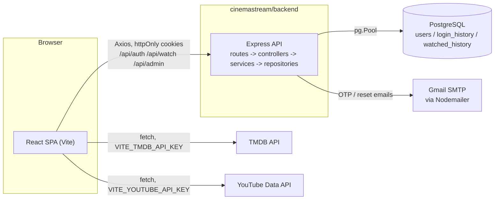

# CinemaStream

CinemaStream is a movie & TV catalogue app: a React frontend for browsing, searching, and tracking titles (catalogue data comes live from [TMDB](https://www.themoviedb.org/)), with a small Express/PostgreSQL API behind it that handles authentication and user data, accounts, login history, and watch history. There's also an admin dashboard for managing users and viewing basic platform stats.

## Features

| Feature | Notes |
|---|---|
| Live TMDB catalogue | Trending, popular, top-rated, new-release, and genre-filtered movies & TV series |
| Infinite scroll | `/movies` and `/series` load more as you scroll |
| Search | Overlay search from the navbar, plus filters on the catalogue pages |
| Trailer & details modal | Trailer playback, cast, genres, and "more like this" recommendations |
| My List & Liked Titles | Personal watchlist/favourites, kept in `localStorage` (not synced to the account) |
| Watch history | Recorded server-side per user; powers a "Continue Watching" row and admin analytics |
| Authentication | Email/password with OTP verification, JWT access + refresh tokens in httpOnly cookies, CSRF protection, password reset |
| Role-based access | `guest` vs `admin`, enforced server-side and client-side |
| Admin dashboard | User list, top-shows chart, monthly user growth, activity heatmap |
| Dark design system | CSS custom properties for colour/spacing/typography, used consistently across the app |

## Architecture

Two independent Node.js apps in one repo, frontend and backend, each with its own `package.json` and `node_modules`. The root `cinemastream/package.json` just runs both dev servers at once via `concurrently`.



A few things worth knowing:
- There's no local movie/series database: all catalogue data comes straight from TMDB. An earlier `movies`/`series`/`genres` table set existed but was never used, so it's gone.
- TMDB and YouTube are called directly from the browser, not proxied through the backend.
- The backend is a plain stateless REST API: no server-rendered views, no WebSockets, no background jobs.

## Repository Structure

```
.
├── .github/workflows/ci.yml        # GitHub Actions: frontend lint + test only
├── .editorconfig
├── README.md
├── CONTRIBUTING.md
├── SECURITY.md
└── cinemastream/
    ├── package.json                 # `concurrently` scripts to run both apps at once
    ├── eslint.config.base.cjs       # ESLint config shared by frontend & backend
    ├── docs/                        # UI design-recommendation + audit markdown docs
    ├── backend/
    │   ├── src/
    │   │   ├── routes/              # auth, protected, watch, admin routers
    │   │   ├── controllers/         # Request/response handling
    │   │   ├── services/            # Business logic (auth, otp, token, email, watch, admin)
    │   │   ├── repositories/        # SQL queries (user, loginHistory, watchedHistory)
    │   │   ├── middleware/          # auth (JWT), csrf, rateLimiter, role, errorHandler
    │   │   ├── config/              # env.js (Joi-validated env), db.js (pg Pool)
    │   │   ├── utils/                # AppError, asyncHandler, cookies, validation schemas
    │   │   ├── app.js                # Express app + middleware/route wiring
    │   │   └── server.js             # HTTP listener entrypoint
    │   ├── db/schema.sql             # DDL for the 3 live tables
    │   └── tests/integration/        # Vitest + Supertest, hits a real DB
    └── frontend/
        ├── src/
        │   ├── api/                  # httpClient (Axios), authApi, adminApi, watchApi, tmdb, youtube
        │   ├── components/{auth,common,catalog,admin}/
        │   ├── pages/{marketing,auth,catalog,admin}/
        │   ├── context/               # AuthContext, DarkModeContext
        │   ├── hooks/                  # useMyList, useLikedTitles, useGenreLookup, useInfiniteScroll, ...
        │   ├── theme/                  # MUI theme mirroring the CSS tokens (admin-only)
        │   └── styles/, assets/        # Global design tokens, shared button/skeleton styles, images
        └── tests/                      # Vitest + React Testing Library
```

## Getting Started

### Prerequisites

- Node.js 20+
- A local PostgreSQL instance
- A [TMDB API key](https://www.themoviedb.org/settings/api)
- A [YouTube Data API v3 key](https://console.cloud.google.com/apis/credentials)
- A Gmail account with an [App Password](https://myaccount.google.com/apppasswords), for sending OTP/reset emails

### Installation

```bash
git clone <repository-url>
cd daas-graduate-project/cinemastream

cd backend && npm install
cd ../frontend && npm install
```

### Running Locally

```bash
cd cinemastream && npm run dev
```

This starts both the backend (`http://localhost:5000`) and frontend (`http://localhost:3000`) together. The Vite dev server proxies `/api/*` to the backend, so the SPA can call it same-origin.

You can also run each app separately in its own terminal with `npm run dev`.
