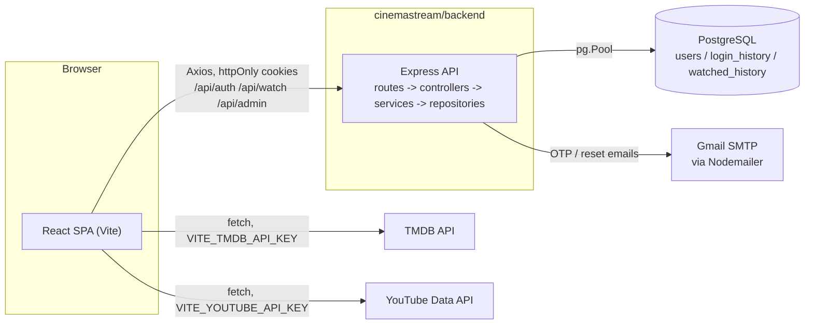

# CinemaStream

CinemaStream is a full-stack movie & TV catalogue application: a React single-page app for browsing, searching, and tracking movies/TV series (all catalogue data sourced live from [TMDB](https://www.themoviedb.org/)), backed by a small stateless Express/PostgreSQL API that owns only authentication and user-generated data: accounts, login history, and watch history. It exists to give users a single place to discover and track titles without the backend needing to license or maintain its own media catalogue, while giving administrators a dashboard for user management and basic platform analytics. *(The "why it exists" framing is an inference from the implemented feature set; no product brief or design doc exists in the repository.)*

**Run it in one command** (after configuring `.env` files, see [Configuration](#configuration)):
```bash
cd cinemastream && npm install && npm run dev
```

## Features

| Feature | Notes |
|---|---|
| Live TMDB catalogue | Trending, popular, top-rated, new-release, and genre-filtered movies & TV series, fetched client-side directly from TMDB, not proxied through the backend |
| Infinite scroll | `/movies` and `/series` load the next page automatically via `IntersectionObserver` as the user scrolls |
| Search | Overlay search across titles and genres from the navbar, plus dedicated search/genre filters on the catalogue pages |
| Trailer & details modal | Trailer playback (resolved via the YouTube Data API), cast, genres, and "more like this" recommendations |
| My List & Liked Titles | Personal watchlist/favourites, persisted in `localStorage` only: **not** synchronised to the backend or tied to the account |
| Watch history | Recorded server-side per authenticated user; powers a "Continue Watching" row and admin analytics |
| Authentication | Email/password registration with OTP email verification, JWT access + refresh tokens in httpOnly cookies, CSRF protection, password reset |
| Role-based access | `guest` vs `admin`, enforced both server-side (route middleware) and client-side (route guarding) |
| Admin dashboard | User list/table, top-shows chart, monthly user-growth chart, weekly activity heatmap |
| Dark design system | CSS custom properties for colour/spacing/typography, applied consistently across auth, catalogue, and admin UI |

## Screenshots

*No screenshots or design assets are checked into the repository.*

| Page | Screenshot |
|---|---|
| Landing page | _placeholder_ |
| Catalogue (`/movies`) | _placeholder_ |
| Admin dashboard | _placeholder_ |

## Architecture

Two independently runnable Node.js applications in one repository. This is **not** an npm-workspaces monorepo (no root `package.json` with a `workspaces` field; each app has its own `node_modules`/lockfile): `cinemastream/package.json` exists only to run both dev servers concurrently from one terminal.



**Verified architectural facts**:
- No local media catalogue: an earlier `movies`/`series`/`genres`/`movie_genres`/`series_genres` table set was dropped after an audit found no backend code reading or writing them.
- TMDB/YouTube are called **directly from the browser** with client-exposed API keys, not proxied through the backend.
- The backend is a pure stateless REST API: no server-rendered views, no WebSockets, no queues/cron/background workers (confirmed by a full inventory of `backend/src`, 30 files total).

## Repository Structure

```
.
├── .github/workflows/ci.yml        # GitHub Actions: frontend lint + test only
├── .editorconfig
├── README.md
├── CONTRIBUTING.md
├── SECURITY.md
└── cinemastream/
    ├── package.json                 # `concurrently` scripts to run both apps at once
    ├── eslint.config.base.cjs       # ESLint config shared by frontend & backend
    ├── docs/                        # UI design-recommendation + audit markdown docs
    ├── backend/
    │   ├── src/
    │   │   ├── routes/              # auth, protected, watch, admin routers
    │   │   ├── controllers/         # Request/response handling
    │   │   ├── services/            # Business logic (auth, otp, token, email, watch, admin)
    │   │   ├── repositories/        # SQL queries (user, loginHistory, watchedHistory)
    │   │   ├── middleware/          # auth (JWT), csrf, rateLimiter, role, errorHandler
    │   │   ├── config/              # env.js (Joi-validated env), db.js (pg Pool)
    │   │   ├── utils/                # AppError, asyncHandler, cookies, validation schemas
    │   │   ├── app.js                # Express app + middleware/route wiring
    │   │   └── server.js             # HTTP listener entrypoint
    │   ├── db/schema.sql             # DDL for the 3 live tables
    │   └── tests/integration/        # Vitest + Supertest, hits a real DB
    └── frontend/
        ├── src/
        │   ├── api/                  # httpClient (Axios), authApi, adminApi, watchApi, tmdb, youtube
        │   ├── components/{auth,common,catalog,admin}/
        │   ├── pages/{marketing,auth,catalog,admin}/
        │   ├── context/               # AuthContext, DarkModeContext
        │   ├── hooks/                  # useMyList, useLikedTitles, useGenreLookup, useInfiniteScroll, ...
        │   ├── theme/                  # MUI theme mirroring the CSS tokens (admin-only)
        │   └── styles/, assets/        # Global design tokens, shared button/skeleton styles, images
        └── tests/                      # Vitest + React Testing Library
```

## Getting Started

### Prerequisites

- **Node.js 20+** (only explicit constraint found is the CI workflow pinning Node 20; neither `package.json` declares an `engines` field)
- A local **PostgreSQL** instance
- A [TMDB API key](https://www.themoviedb.org/settings/api)
- A [YouTube Data API v3 key](https://console.cloud.google.com/apis/credentials)
- A Gmail account with an [App Password](https://myaccount.google.com/apppasswords) (OTP/reset emails via SMTP)

### Installation

```bash
git clone <repository-url>
cd daas-graduate-project/cinemastream

(cd backend && npm install)
(cd frontend && npm install)
npm install   # optional: installs the root `concurrently` helper
```

### Configuration

Copy each app's example env file and fill in the values:
```bash
cp backend/.env.example backend/.env
cp frontend/.env.example frontend/.env
```

### Running Locally

Three ways to start the app exist in the repo:

```bash
# 1. Both apps at once, from cinemastream/ (recommended)
cd cinemastream && npm run dev

# 2. Each app separately, two terminals
cd cinemastream/backend && npm run dev     # http://localhost:5000 (nodemon)
cd cinemastream/frontend && npm run dev    # http://localhost:3000 (vite)

# 3. Backend without file-watching
cd cinemastream/backend && npm start       # plain `node src/server.js`
```

The Vite dev server proxies `/api/*` to `http://localhost:5000` (`vite.config.js`), so the SPA can call the backend same-origin during development.

> `cinemastream/package.json` also defines `npm start`, but its `start:frontend` script (`cd frontend && npm start`) maps to `frontend/package.json`'s `"start": "vite"`: Vite's **dev** server, not a production build/preview. Despite the name, `npm start` from `cinemastream/` does not serve a production build.

### Building

```bash
cd cinemastream/frontend
npm run build     # production bundle via Vite
npm run preview   # serve the built bundle locally
```

The backend has no build step: plain CommonJS Node.js, run directly.

### Running Tests

```bash
cd cinemastream/frontend && npm test   # Vitest + RTL, jsdom
cd cinemastream/backend && npm test    # Vitest + Supertest, against a REAL local Postgres DB
```

Backend tests truncate `login_history`/`users` before each test and hit the real Express app: point `POSTGRES_URI` (via a required `.env.test`, same variable set as `.env`) at a database you're okay with being wiped.
