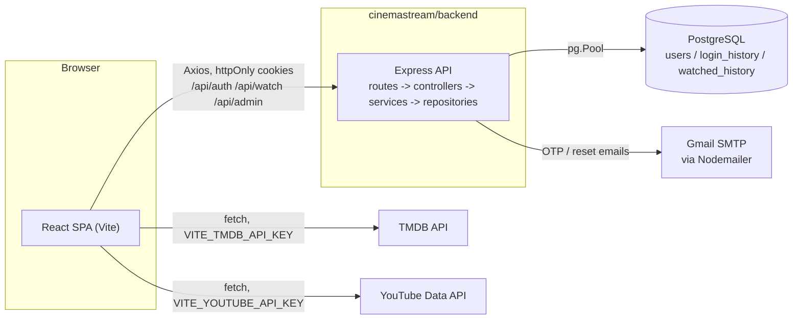
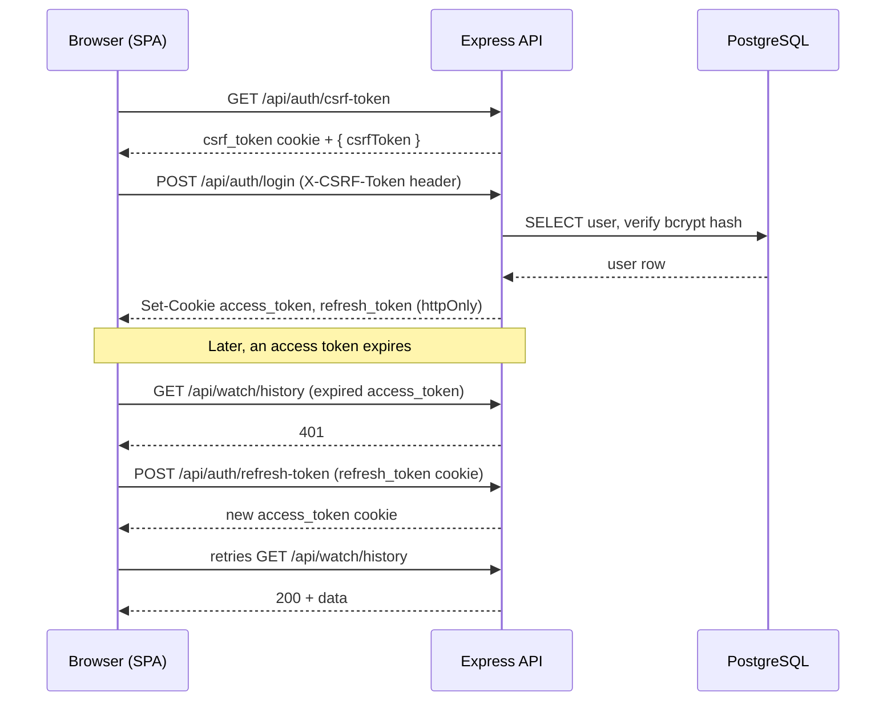
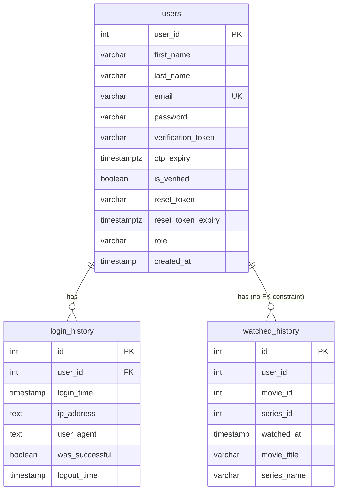

# CinemaStream

CinemaStream is a full-stack movie & TV catalog application: a React single-page app for browsing, searching, and tracking movies/TV series (all catalog data sourced live from [TMDB](https://www.themoviedb.org/)), backed by a small stateless Express/PostgreSQL API that owns only authentication and user-generated data — accounts, login history, and watch history. It exists to give users a single place to discover and track titles without the backend needing to license or maintain its own media catalog, while giving administrators a dashboard for user management and basic platform analytics. *(The "why it exists" framing is an inference from the implemented feature set — no product brief or design doc exists in the repository.)*

**Stack at a glance**: React 19 + Vite (frontend) · Node.js + Express 5 (backend) · PostgreSQL · JWT + CSRF auth · TMDB/YouTube APIs.

**Run it in one command** (after configuring `.env` files — see [Configuration](#configuration)):
```bash
cd cinemastream && npm install && npm run dev
```

## Features

| Feature | Notes |
|---|---|
| Live TMDB catalog | Trending, popular, top-rated, new-release, and genre-filtered movies & TV series — fetched client-side directly from TMDB, not proxied through the backend |
| Infinite scroll | `/movies` and `/series` load the next page automatically via `IntersectionObserver` as the user scrolls |
| Search | Overlay search across titles and genres from the navbar, plus dedicated search/genre filters on the catalog pages |
| Trailer & details modal | Trailer playback (resolved via the YouTube Data API), cast, genres, and "more like this" recommendations |
| My List & Liked Titles | Personal watchlist/favourites, persisted in `localStorage` only — **not** synced to the backend or tied to the account |
| Watch history | Recorded server-side per authenticated user; powers a "Continue Watching" row and admin analytics |
| Authentication | Email/password registration with OTP email verification, JWT access + refresh tokens in httpOnly cookies, CSRF protection, password reset |
| Role-based access | `guest` vs `admin`, enforced both server-side (route middleware) and client-side (route guarding) |
| Admin dashboard | User list/table, top-shows chart, monthly user-growth chart, weekly activity heatmap |
| Dark design system | CSS custom properties for color/spacing/typography, applied consistently across auth, catalog, and admin UI |

## Screenshots

*No screenshots or design assets are checked into the repository.*

| Page | Screenshot |
|---|---|
| Landing page | _placeholder_ |
| Catalog (`/movies`) | _placeholder_ |
| Admin dashboard | _placeholder_ |

## Architecture

Two independently runnable Node.js applications in one repository. This is **not** an npm-workspaces monorepo (no root `package.json` with a `workspaces` field; each app has its own `node_modules`/lockfile) — `cinemastream/package.json` exists only to run both dev servers concurrently from one terminal.



**Verified architectural facts**:
- No local media catalog: an earlier `movies`/`series`/`genres`/`movie_genres`/`series_genres` table set was dropped after an audit found no backend code reading or writing them.
- TMDB/YouTube are called **directly from the browser** with client-exposed API keys, not proxied through the backend.
- The backend is a pure stateless REST API: no server-rendered views, no WebSockets, no queues/cron/background workers (confirmed by a full inventory of `backend/src`, 30 files total).

## Technology Stack

### Frontend (`cinemastream/frontend`)

| Category | Technology |
|---|---|
| Framework | React 19.1, built/served with Vite 6 |
| Routing | React Router v7.5 |
| HTTP client | Axios 1.9 (`src/api/httpClient.js`) for the backend; native `fetch` for TMDB/YouTube |
| Styling | Plain CSS with CSS custom properties as a design-token system — **no Tailwind, no CSS Modules**. `sass` compiles the admin dashboard's `.scss` files only |
| UI kit | MUI 9 (`@mui/material`, `@mui/x-data-grid`) — admin dashboard only |
| Charts | `recharts`, `react-plotly.js` — admin dashboard only |
| Icons / media | `react-icons`, `react-youtube` |
| Testing | Vitest 2 + `@testing-library/react`/`jest-dom`, jsdom environment |
| Lint/format | ESLint 9 (flat config, extends shared `cinemastream/eslint.config.base.cjs`) + Prettier 3 |

### Backend (`cinemastream/backend`)

| Category | Technology |
|---|---|
| Framework | Node.js + Express 5.1 |
| Database | PostgreSQL via `pg` 8.16 (plain `Pool`, no ORM) |
| Auth | `jsonwebtoken` 9 (access + refresh tokens, httpOnly cookies), `bcrypt` 6 for password hashing |
| Validation | `joi` 17 — both request bodies and env-var validation at boot |
| Security middleware | Custom CSRF (double-submit cookie), `express-rate-limit` 7 (auth endpoints only), `cors` 2.8 with `credentials: true` |
| Email | `nodemailer` 7 over Gmail SMTP |
| Testing | Vitest 2 + Supertest 7, against a real local Postgres instance |
| Lint/format | ESLint 9 (same shared base config) + Prettier 3 |

## Repository Structure

```
.
├── .github/workflows/ci.yml        # GitHub Actions: frontend lint + test only
├── .editorconfig
├── README.md
├── CONTRIBUTING.md
├── SECURITY.md
└── cinemastream/
    ├── package.json                 # `concurrently` scripts to run both apps at once
    ├── eslint.config.base.cjs       # ESLint config shared by frontend & backend
    ├── docs/                        # UI design-recommendation + audit markdown docs
    ├── backend/
    │   ├── src/
    │   │   ├── routes/              # auth, protected, watch, admin routers
    │   │   ├── controllers/         # Request/response handling
    │   │   ├── services/            # Business logic (auth, otp, token, email, watch, admin)
    │   │   ├── repositories/        # SQL queries (user, loginHistory, watchedHistory)
    │   │   ├── middleware/          # auth (JWT), csrf, rateLimiter, role, errorHandler
    │   │   ├── config/              # env.js (Joi-validated env), db.js (pg Pool)
    │   │   ├── utils/                # AppError, asyncHandler, cookies, validation schemas
    │   │   ├── app.js                # Express app + middleware/route wiring
    │   │   └── server.js             # HTTP listener entrypoint
    │   ├── db/schema.sql             # DDL for the 3 live tables
    │   └── tests/integration/        # Vitest + Supertest, hits a real DB
    └── frontend/
        ├── src/
        │   ├── api/                  # httpClient (Axios), authApi, adminApi, watchApi, tmdb, youtube
        │   ├── components/{auth,common,catalog,admin}/
        │   ├── pages/{marketing,auth,catalog,admin}/
        │   ├── context/               # AuthContext, DarkModeContext
        │   ├── hooks/                  # useMyList, useLikedTitles, useGenreLookup, useInfiniteScroll, ...
        │   ├── theme/                  # MUI theme mirroring the CSS tokens (admin-only)
        │   └── styles/, assets/        # Global design tokens, shared button/skeleton styles, images
        └── tests/                      # Vitest + React Testing Library
```

## Getting Started

### Prerequisites

- **Node.js 20+** (only explicit constraint found is the CI workflow pinning Node 20 — neither `package.json` declares an `engines` field)
- A local **PostgreSQL** instance
- A [TMDB API key](https://www.themoviedb.org/settings/api)
- A [YouTube Data API v3 key](https://console.cloud.google.com/apis/credentials)
- A Gmail account with an [App Password](https://myaccount.google.com/apppasswords) (OTP/reset emails via SMTP)

### Installation

```bash
git clone <repository-url>
cd daas-graduate-project/cinemastream

(cd backend && npm install)
(cd frontend && npm install)
npm install   # optional: installs the root `concurrently` helper
```

### Configuration

Copy each app's example env file and fill in the values:
```bash
cp backend/.env.example backend/.env
cp frontend/.env.example frontend/.env
```

**Backend** (`cinemastream/backend/.env`) — validated with Joi at startup (`src/config/env.js`); the process **fails to boot** if a required variable is missing/invalid:

| Variable | Required | Default | Description |
|---|---|---|---|
| `NODE_ENV` | No | `development` | `development` \| `test` \| `production` |
| `PORT` | No | `5000` | Port the Express server listens on |
| `POSTGRES_URI` | **Yes** | — | Postgres connection string (must start with `postgres:`/`postgresql:`) |
| `JWT_SECRET` | **Yes** | — | Signs access tokens; min 16 characters |
| `REFRESH_SECRET` | **Yes** | — | Signs refresh tokens; min 16 characters; should differ from `JWT_SECRET` |
| `EMAIL_USER` | **Yes** | — | Gmail address used to send OTP/reset emails |
| `EMAIL_PASS` | **Yes** | — | Gmail **App Password** (not the account password) |
| `CORS_ORIGIN` | **Yes** | — | Exact origin the frontend is served from (scheme+host+port must match) |

**Frontend** (`cinemastream/frontend/.env`) — read at build/dev time via `import.meta.env`:

| Variable | Required | Default | Description |
|---|---|---|---|
| `VITE_TMDB_API_KEY` | **Yes** | — | TMDB API key — powers the entire catalog/search UI |
| `VITE_YOUTUBE_API_KEY` | **Yes** | — | YouTube Data API key — resolves trailer video IDs |

### Running Locally

Three ways to start the app exist in the repo:

```bash
# 1. Both apps at once, from cinemastream/ (recommended)
cd cinemastream && npm run dev

# 2. Each app separately, two terminals
cd cinemastream/backend && npm run dev     # http://localhost:5000 (nodemon)
cd cinemastream/frontend && npm run dev    # http://localhost:3000 (vite)

# 3. Backend without file-watching
cd cinemastream/backend && npm start       # plain `node src/server.js`
```

The Vite dev server proxies `/api/*` to `http://localhost:5000` (`vite.config.js`), so the SPA can call the backend same-origin during development.

> `cinemastream/package.json` also defines `npm start`, but its `start:frontend` script (`cd frontend && npm start`) maps to `frontend/package.json`'s `"start": "vite"` — Vite's **dev** server, not a production build/preview. Despite the name, `npm start` from `cinemastream/` does not serve a production build.

### Building

```bash
cd cinemastream/frontend
npm run build     # production bundle via Vite
npm run preview   # serve the built bundle locally
```

The backend has no build step — plain CommonJS Node.js, run directly.

### Running Tests

```bash
cd cinemastream/frontend && npm test   # Vitest + RTL, jsdom
cd cinemastream/backend && npm test    # Vitest + Supertest, against a REAL local Postgres DB
```

Backend tests truncate `login_history`/`users` before each test and hit the real Express app — point `POSTGRES_URI` (via a required `.env.test`, same variable set as `.env`) at a database you're okay with being wiped.

## Usage

1. Visit `http://localhost:3000` and register (email + password).
2. Check your inbox for a 6-digit OTP and verify at `/verify-otp`.
3. Log in — lands on `/Homepage` (capital `H`; an existing route-naming inconsistency versus the rest of the app's lowercase routes).
4. Browse `/movies` or `/series`, scroll to trigger infinite loading, use the navbar search overlay, or filter by genre.
5. Click a title to open the trailer/details modal; use the card's quick actions to add it to My List or Like it (both `localStorage`-only).
6. An account with `role = 'admin'` in the `users` table can access `/home`, `/admin/users`, and `/admin/stats`. There is no self-service way to become an admin — it must be set directly in the database.

## Authentication

- **Password hashing**: `bcrypt`.
- **Session tokens**: short-lived JWT access token + longer-lived refresh token, both **httpOnly** cookies.
- **CSRF protection**: double-submit-cookie pattern — a `csrf_token` cookie (`value|timestamp`, 24h expiry) must match an `X-CSRF-Token` header on mutating requests; obtained from `GET /api/auth/csrf-token`.
- **Email verification**: registration creates an unverified account and emails an OTP; login is blocked until verified.
- **Password reset**: emailed reset token, expiring, single-use.
- **Rate limiting**: 5 requests / 15 minutes per IP on all auth endpoints except `/logout`, `/refresh-token`, `/check-auth`, `/csrf-token` (disabled when `NODE_ENV=test`).
- **Roles**: `guest` (default for new signups) and `admin`, enforced via `checkRole` middleware server-side and `ProtectedRoute`'s `roles` prop client-side.



The refresh flow is implemented client-side in `src/api/httpClient.js`'s Axios response interceptor (retries once on 401, excluding the auth endpoints themselves; on a second failure it dispatches a `window` `auth:session-expired` event, which `AuthContext` listens for to clear the client-side session).

See [SECURITY.md](SECURITY.md) for the full security posture (measures in place and known gaps) and how to report a vulnerability.

## API Overview

All endpoints are mounted under `/api` (`app.js`), plus an unauthenticated `GET /health` → `200 OK`.

**Auth** (`/api/auth`) — all mutating routes are CSRF-protected and rate-limited (5/15min) except where noted:

| Method & Path | Auth | Description |
|---|---|---|
| `POST /register` | CSRF | Create unverified account, send OTP email |
| `POST /login` | CSRF | Verify credentials, set access/refresh cookies |
| `POST /logout` | JWT | Clear session, record logout time |
| `POST /verify-otp` | CSRF | Verify email with OTP code |
| `POST /resend-otp` | CSRF | Issue a new OTP |
| `POST /forgot-password` | CSRF | Email a password-reset token |
| `POST /reset-password` | CSRF | Set new password using the reset token |
| `POST /refresh-token` | Refresh cookie | Not rate-limited/CSRF-protected — issue new access token |
| `GET /check-auth` | JWT | Not rate-limited — return current user |
| `GET /csrf-token` | None | Issue a CSRF token |

**Protected** (`/api/protected`) — demo/example routes; **confirmed unused by the frontend** (no client code calls either):

| Method & Path | Auth |
|---|---|
| `GET /admin-only` | JWT + `role=admin` |
| `GET /guest-content` | JWT + `role=guest` or `admin` |

**Watch** (`/api/watch`):

| Method & Path | Auth | Description |
|---|---|---|
| `POST /` | JWT + CSRF | Record a watch event |
| `GET /history` | JWT | Current user's recent watch history |

**Admin** (`/api/admin`) — entire router gated at once via `router.use(verifyToken, checkRole('admin'))`:

| Method & Path | Description |
|---|---|
| `GET /users` | List all users |
| `GET /stats/top-shows` | Most-watched titles, from `watched_history` |
| `GET /stats/monthly-growth` | New users per month, last 12 months |
| `GET /stats/heatmap` | Watch activity by day-of-week × time-of-day |

Business-logic failures (wrong password, unverified email, etc.) resolve with HTTP 200 and `{"status": "FAILED", "message": "..."}` rather than an error status — only network/validation/server errors return non-2xx.

## Database

PostgreSQL, no ORM, no migration tool — `cinemastream/backend/db/schema.sql` is a hand-maintained, plain-SQL source of truth applied with `psql`. `db/seed.local.sql` is a gitignored, local-only data dump (not a version-controlled seed script).



- **`watched_history.user_id`/`movie_id`/`series_id` have no foreign-key constraints** — `movie_id`/`series_id` are raw TMDB ids, and `movie_title`/`series_name` are a denormalized snapshot taken at watch time (avoids a TMDB round-trip for admin analytics).
- **Explicitly unused tables that were dropped**: the schema previously included `movies`, `series`, `genres`, `movie_genres`, and `series_genres` (a TMDB metadata cache). An audit found zero backend code referencing them — removed rather than kept as dead weight.
- Only one index beyond primary keys: `idx_users_created_at`.

## External Services

| Service | Used for | Where |
|---|---|---|
| **TMDB API** | All movie/TV catalog data — trending, discover, search, genres, details | `frontend/src/api/tmdb.js`, called directly from the browser |
| **YouTube Data API v3** | Resolving a trailer video ID from a title | `frontend/src/api/youtube.js`, called directly from the browser |
| **Gmail SMTP (Nodemailer)** | OTP verification emails and password-reset emails | `backend/src/services/email.service.js` |

No other third-party integrations (no payments, no OAuth, no analytics/error-reporting SaaS) were found.

## Deployment

**No deployment configuration exists in this repository** — no `Dockerfile`, `docker-compose.yml`, `Procfile`, `render.yaml`, `vercel.json`, `netlify.toml`, `fly.toml`, or Kubernetes manifests were found anywhere.

**CI**: `.github/workflows/ci.yml` runs on push to `develop` and on PRs into `develop`/`main` — installs frontend deps, runs `npm run lint --if-present` and `npm test` for the frontend only. It does not build, publish an artifact, or deploy anything, and there is **no backend CI job**.

## Development

Inferred from configuration, not a written contributing guide:

- **Linting/formatting**: both apps share one ESLint flat config (`cinemastream/eslint.config.base.cjs`) and one Prettier config (`cinemastream/.prettierrc.json`); run `npm run lint` / `npm run format` inside either app.
- **Branch model**: `develop` and `main` both exist and both trigger CI on PRs; `develop` is also a direct-push CI trigger. This implies a `develop`-first workflow (feature branches → PR into `develop` → eventually `main`), but this is inferred from the CI trigger config only, not documented anywhere.
- **Commit convention**: recent history follows a loose Conventional Commits style (`feat:`, `fix:`, `chore:`, `docs:`) — not enforced by any tool (no commitlint/husky config found).

## Contributing

See [CONTRIBUTING.md](CONTRIBUTING.md) for branching, local checks to run before opening a PR, and code style. No issue/PR templates exist in this repository.

## Known Limitations

- **TMDB/YouTube API keys are shipped in the client bundle** (`VITE_`-prefixed vars are inlined at build time) — visible to anyone inspecting network requests or the bundle.
- **No error boundary** anywhere in the React tree — an unhandled render error unmounts the whole app.
- **No code-splitting** (`React.lazy`/`Suspense`: zero usages) — every route is eagerly bundled; `React.memo` is also never used (though `useMemo`/`useCallback` are used moderately).
- **No SSL/pool tuning on the Postgres connection** — `config/db.js` passes only `connectionString` to `pg.Pool`.
- **No graceful shutdown** — `server.js` never listens for `SIGTERM`/`SIGINT` or calls `pool.end()`.
- **No logging library or request logging** — 5 total `console.log`/`console.error` call sites in the entire backend; no access logs, no structured logging, no error-reporting integration.
- **Thin test coverage** — frontend: 3 test files (`LandingPage`, `Login`, `AuthContext`), all render/behavior smoke tests. Backend: 1 integration file, 11 tests, auth flows only — no coverage for `watch`, `admin`, or `protected` routes, and no unit tests anywhere.
- **`/Homepage` route casing** is inconsistent with the rest of the app's lowercase routes.
- **Known dependency vulnerabilities** — `npm audit` currently reports 13 issues in the frontend (3 moderate, 9 high, 1 critical) and 11 in the backend (3 moderate, 7 high, 1 critical). Not auto-remediated as part of this pass since `npm audit fix --force` can introduce breaking changes — run `npm audit` in each app and evaluate fixes individually. See [SECURITY.md](SECURITY.md).

## Roadmap

No `TODO`/`FIXME`/`HACK` comments exist anywhere in the codebase (verified via full-repo grep). Everything below is **inferred** from incomplete or inconsistent implementations, not from any planning artifact:

- Wire up or remove `DarkModeContext` — its toggle is exposed in the admin navbar, but the resulting `darkMode` value is never read anywhere to change styling.
- Remove the unused `/api/protected` demo routes, or wire them into the frontend if they were meant to be used.
- Sync My List / Liked Titles to the backend — currently `localStorage`-only, so it doesn't follow a user across devices, despite `watched_history` already proving the backend can model per-user title interactions.
- Add a backend CI job (lint + test) — only the frontend runs in CI today.
- Add any deployment pipeline — none exists in any form today.

## License

**No `LICENSE` file exists in this repository.** `backend/package.json` declares `"license": "ISC"` (the npm-init default, with no corresponding `LICENSE` file); `frontend/package.json` declares no license field at all. Treat this as all rights reserved unless a license is explicitly added.
